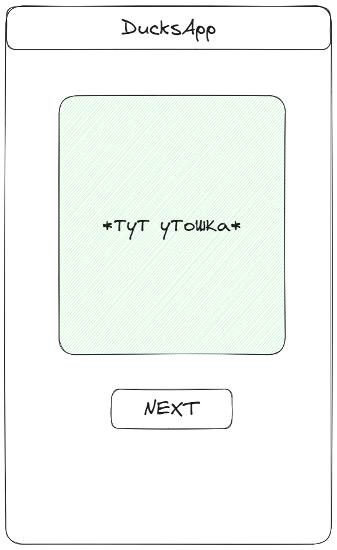

# Смотри демонстрацию в файле demo.mp4 

# Что это за репозиторий?

Это репозиторий - шаблон проекта для выполнения практической части в рамках лекции мегашколы 
"Технологии программной инженерии и разработки мобильных приложений". Цель данного задания -
потрогать азы нативной разработки под андроид.

# Задание

Необходимо реализовать простое приложение, которое будет показывать картинки уточек
из [открытого апи](https://random-d.uk/api).

Само задание делится на 2 части - простой и более простой.

## 1 Часть

В проекте уже есть небольшая заготовка в виде реализованного сетевого слоя. В сеть приложение ходит
при помощи библиотеки `Retrofit`. Для этого есть `DucksApi` - место где объявляются методы для
хождения на
эндпоинты и `Api` - оболочка, при помощи которой можно достучаться до `DucksApi`.

В первой части будет необходимо реализовать экран, на котором будет отображаться картинка случайной
утки и кнопка, при нажатии на которую можно будет получить следующую случайную утку

> Вызов `DucksApi` при этом должен быть неблокирующим!

Для отображения картинок можно воспользоваться средствами `Android SDK` (при помощи `BitMap`) или
подключить и заиспользовать специально предназначенные для этого библиотеки - `Picasso`, `Glide` или
`Fresco`.

> Пример как можно реализовать
>
> 

# 2 часть

Вторая часть выполняется после успешного выполнения первой. В интерфейс теперь
добавляется `EditText`,
куда мы теперь можем что-то записывать. А записывать мы будем туда различные `http` коды и при
нажатии
на кнопку получать картинку утошки, отображающую этот код.

При этом если `EditText` пустой, при нажатии на кнопку мы будем запрашивать случайную картинку, как
это было сделано в 1 части

> При этом нельзя забывать о валидации `EditText`. Пользователь не должен уметь отправлять
> невалидное
> значение на сервер!

Для реализации этого нужно будет в отличие от 1 части доделать сетевой слой, чтобы он смог ходить на
эндпоинт `GET /http/:code` ([см документацию](https://random-d.uk/api))

> Сам интерфейс при этом может выглядить примерно так
>
> 

# Как сдать задание и получить баллы?

Исходный код необходимо будет опубликовать на любом удобном или любимов хостинге, **приложив туда
видео работы вашего приложения** (можно записать прямо с эмулятора) (при всем своем желании я не смогу
спулить и запустить практики около сотни студентов)

> Если в репо не будет в видном месте (желательно в корне) лежать видео, я с большой вероятностью
> пропущу это задание

После этого нужно будет [отправить форму](https://forms.gle/4XwtgH8cUrDyXq8aA) и я проверю задание

> И напоследок, любые визуальные изыски, улучшения и усложнения (осмысленные) - welcome!
